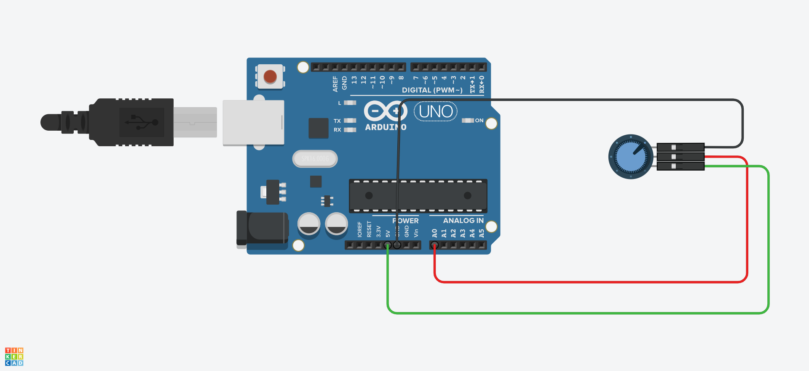
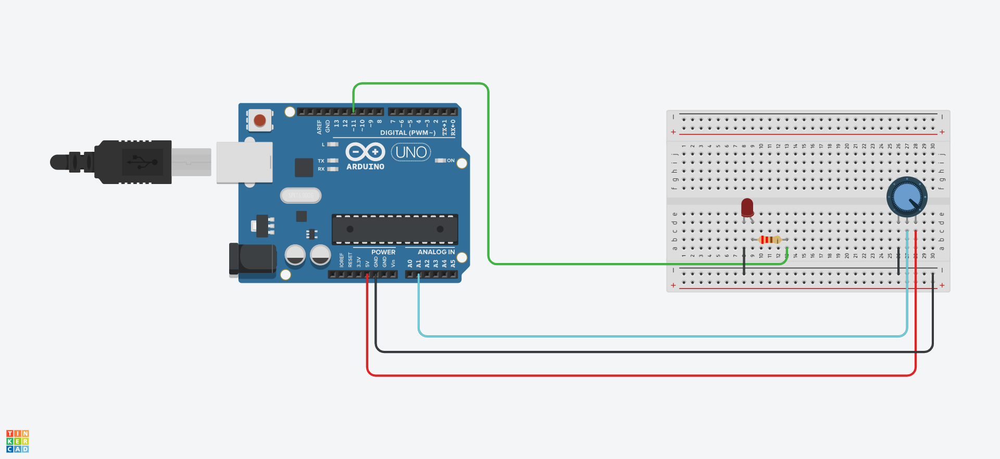

## Declaring Variables With **( #define )**

* Use For **constant value**

* **TB:** The **Constrants value** --> **don't take any program memory space on the chip ( board )** also **we can't change constant value**

* How to define the **( #define )**

```c++

// right way 
#define Variable_Name Value // Note compiler will replace any mentioned value of ( Variable_Name ) with the vlaue of ( Value ) at compile time

// wrong way
#define Varible_Name = Value

#define Varible_Name = Value;

#define Varible_Name Value;

```

## Declaring Variables With **( Int, Float )**

```c++

int Variable_Name = Value;

```

## Declaring Variables With **( const )**

* Make variable ( read ) only
  
* Make the Value of this variable unchangeable

```c++

const float Variable_Name = Value;

// You can use constant value in math
New_Variable_Name =  Variable_Name * Value 

// We Can't change constant value
Variable_Name =  New_Value // Error

```

* **TB:**  **const or #define** use for creating **numeric or string constants**.

## Int Vs Const int

|  Keyword   |       Int     |      Const int      |
|------------|:-------------:|:-------------------:|
| read/write |  read/write   |        read         |
| change     |     allow     |      not allow      |
| memory     |   use memory  |  don't use memory   |


## Declaring Variables With **( Unsigned int )**

* Range is between ( 0 - 65,535 ) = ( 2^16 - 1 )

* Store 2 byte of value

* Store only positive number this is mean negative number don't allow

```c++

unsigned int Variable_Name = Value;

```

## **void**

* Use for **function declaration**

* It is mean that the **function don't return any value**

```c++

void setup() {
    // ....
}

void loop() {
    // ....
}

```

## **Constants**

* Defining **Logical Levels**: **true** and **false** ( **Boolean Constants** )

* Defining **Pin Levels**: **HIGH** and **LOW**

## **Boolean Constants**

* **0 always False** but **except 0 all value is True**
    - false = 0
    - true = 1, 2, 3, +200, -200, ...

## **HIGH** and **LOW**

* **HIGH pin**
  
    - If pin is configured as an **INPUT**, the voltage of this pin is **( greater than 3.0V )**

    - If pin is configured as **OUTPUT**, the pin is **5V**

* **LOW pin**

    - If pin is configured as **INPUT**, the pin **voltage less than 1.5V for pin (5V boards)**

    - If pin is configured as **OUTPUT**, the pin is **0 volts for both ( 5V and 3.3V boards )**

## **#include**

* **( #include )** is used to include **outside libraries** in your sketch.

```c++

#include <Library_Name.h>

#include "Library_Name.h"

```

## Structure **setup(){ ... }**

* In **setup()** function only run 1 time after each powered up or reset of the Arduino.
  
```c++

int buttonPin = 3;

void setup() {
    Serial.begin(9600);
    pinMode(buttonPin, INPUT);
}

```

## Structure **loop(){ ... }**

* In **loop()** function, your code will **repeat over and over again**. 

```c++

void loop() {
    //
}

```

## **Control** Structure

* To control statements
* Break
* Continue
* Goto
* Switch Case
* And all types of loop
    - For loop
    - While loop
    - Do … while

## **Break**

* break is **used to exit** from **( for, while, do… while) loop**

```c++

// Statement

break;


void setup() {
    Serial.begin(9600);
}

void loop() {
    for ( int x = 0; x <= 255; x++ ) {
        // if ( x > 40 && x < 120 ) {
        if ( x > 40 ) {
            break; 
        }
        Serial.println(x);
        delay(100); 
    }
}


// Output

0...40 --> break

```

## **Continue**

* The continue statement **skips the rest of the current iteration** of a **( for, while, do…while ) loop**.

```c++

// Statement

continue;


void setup() {
    Serial.begin(9600);
}

void loop() {
    for ( int x = 0; x <= 255; x++ ) {
        if ( x > 40 && x < 120 ) {
            // create jump in values
            continue; 
        }
        Serial.println(x);
        delay(100); 
    }
}


// Output

0...40 --> ( jumped value ) <-- 120...255

```

## **Goto**

* **Transfers** --> **program flow** --- to a ---> **labeled point** in the program

```c++

for(int r = 0; r < 255; r++) {
    for(int b = 0; b < 255; b++) {
        if (analogRead(0) > 250) { 
            goto bailout;
        }
        // more statements ...
    } 
} 

bailout:

```

## **Switch Case**

```c++

switch (var) {
    case 1: // label1
    //do something when var equals 1
    break;

    case 2: // label2
    //do something when var equals 2
    break; 
    
    default: // default label
    // if nothing else matches, do this
    // default is optional in your work with switch statement
    break;
}

```

## FUNCTIONS

* Digital I/O

```c++

pinMode()
digitalRead()
digitalWrite()

```

* Analog I/O

```c++

analogRead()
analogWrite()

```

* Time

```c++

delay()

```

* Math

```c++

abs()
pow()
sq()
sqrt()

```

* communication

```c++

// Serial
Serial.begin()
Serial.end()
Serial.available()
Serial.read()
Serial.write()
Serial.print()

```

## pinMode()

```c++

// Syntax

pinMode(pin, mode) // pin: the number of the pin in arduino board // mode: ( INPUT, OUTPUT ) for this pin

// Example

pinMode(13, INPUT)
pinMode(13, OUTPUT)

// Return

nothing

```

## digitalRead()

* TB: The analog input pins can be used as digital pins, referred to as A0, A1, etc.

* digitalRead() is for pin INPUT

```c++

// Syntax

digitalRead(pin) // pin: the number of the digital pin you want to read

// Example

digitalRead(13)

// Return
HIGH / LOW

```

## digitalWrite()

* digitalWrite() is for pin OUTPUT

```c++

// Syntax

digitalWrite(pin, value) // pin: the pin number // value: HIGH / LOW

```

### digitalRead(), digitalWrite() Example Code

```c++

int ledPin = 13; // LED connected to digital pin 13
int inPin = 2; // pushbutton connected to digital pin 7
int val; // variable to store the read value

void setup() {
  pinMode(ledPin, OUTPUT); // sets the digital pin 13 as output
  pinMode(inPin, INPUT); // sets the digital pin 7 as input
}

void loop() {
  val = digitalRead(inPin); // read the input pin
  digitalWrite(ledPin, val); // sets the LED to the button's value
}

```

* Depedensy

    - Arduino Uno board * 1
    - USB cable * 1
    - button * 1
    - resistor 1k ohm or 10k ohm * 1
    - led * 1
    - Jumper wires


## analogRead()

analog pin. in Arduino board contains a 6 channel, 10-bit analog to digital converter. input voltages between 0 and 5 volt the values between 0 and 1023 and read like this ( `5 volts / 1024 units` or, `.0049 volts` `(4.9 mV) per unit`

```c++

// Syntax

analogRead(pin) // pin: the number of the analog input pin to read from (A0 to A5 on most boards, A0 to A6 on MKR boards, A0 to A7 on the Mini and Nano, 0 to 15 on the Mega)


//  Returns

int(0 to 1023)

```

### analogRead() Example Code

```c++

int analogPin = A0; // potentiometer wiper connected to analog pin 3
int val ; // variable to store the value read

void setup() {
    Serial.begin(9600);
} // setup serial

void loop() {
    val = analogRead(analogPin);
    Serial.println(val);
}

```

* Depedensy

    - Arduino Uno board * 1
    - USB cable * 1
    - Potentiometer * 1
    - Jumper wires



## analogWrite()

* On most Arduino boards this function works on pins **3, 5, 6, 9, 10, and 11**, You do not need to call **pinMode()** to set the pin as an **output** before calling **analogWrite()**.

* The **PWM** outputs generated on pins **5 and 6** will have **higher-than-expected duty cycles**, This is because of **interactions with the millis()** and **delay() functions**, which **share the same internal timer used to generate those PWM outputs**.

```c++

// Syntax

analogWrite(pin, value) // analogRead values go from 0 to 1023, analogWrite values from 0 to 255.

```

### analogWrite() Example Code

```c++

#define LED_PIN 11
#define POTENTIOMETER_PIN A1

void setup() {
  pinMode(LED_PIN, OUTPUT);
}

void loop() {
  int potentiometerValue = analogRead(POTENTIOMETER_PIN);
  int brightness = potentiometerValue / 4;
  analogWrite(LED_PIN, brightness);
}

```

* Depedensy

    - Arduino Uno board * 1
    - USB cable * 1
    - Resistor (220Ω) * 1
    - LED * 1
    - Potentiometer * 1
    - Breadboard * 1
    - Jumper wires



## delay()

```c++

// Syntax

delay(ms) // ms: the number of milliseconds to pause (unsigned long)

```

## abs()

* returns the absolute value of an integer number.

```c++

// Syntax

abs(x) // x: the number

// Example

abs(-1) // = 1

// Example 

void setup() {
  Serial.begin(9600);

  int x = -4;
  int y = abs(x);
  Serial.print("The absolute value of of ");
  Serial.print(x);
  Serial.print(" is ");
  Serial.println(y); 
  // output: The absolute value of of -4 is 4
}

void loop() {}


```

## pow()

```c++

// Syntax

pow(base, exponent) 

// Example

void setup() {
   // put your setup code here, to run once:
   Serial.begin(9600);
   float base = 2;
   float exponent = 3;
   Serial.println(pow(base,exponent));
}

void loop() {
   // put your main code here, to run repeatedly:
}

```

## sq()

```c++

// Syntax

sq(x) // x: the number, any data type

// Example

void setup() {
   // put your setup code here, to run once:
   Serial.begin(9600);
   float x = 4.0;
   Serial.println(sq(x)); // 4.0 * 4.0 = 16.00
    /*
    Output
         16.00
    */
}

void loop() {
   // put your main code here, to run repeatedly:
}


// Return

The square of the number.

```

## sqrt()

```c++

// Syntax

sqrt(x) // x: the number, any data type

// Example

void setup() {
   // put your setup code here, to run once:
   Serial.begin(9600);
   float x = 4.0;
   Serial.println(sqrt(x)); // √4 = 2
    /*
    Output
         2.00
    */
}

void loop() {
   // put your main code here, to run repeatedly:
}


// Return

The number’s square root. (double)

```

## Serial

* Serial use for communication between the Arduino board and a computer or other devices.
  
* for this communicates we use digital pins 0 (RX) and 1 (TX).

* if you use these functions, you cannot use pins 0 and 1 for digital input or output.


## Serial.begin()

* Serial.begin() Sets the data **rate in bits per second (baud)** for serial data transmission.

```c++

Serial.begin(600);  // rate to 600 bps
Serial.begin(1200); // rate to 1200 bps
Serial.begin(2400); // rate to 2400 bps
Serial.begin(4800); // rate to 4800 bps
Serial.begin(9600); // rate to 9600 bps
......

```

## Serial.end()

* Serial.end() will **Disables serial communication**, allowing the **RX and TX pins** to be used for general **input and output**.

```c++

Serial.end();

```

## Serial.available()

* Get the number of bytes (characters) available for reading from the serial port.

* This is data stored in the serial receive buffer (which holds 64 bytes)

```c++

Serial.available()

```

## Serial.read()

* Reads incoming serial data.
  
```c++

Serial.read()

// Returns 

not an int

```

### Serial.read(),Serial.available() Example Code

```c++

int incomingByte = 0; // for incoming serial data

void setup() {
    Serial.begin(9600); 
} // opens serial port, sets data rate to 9600 bps

void loop() {
    if (Serial.available() > 0) {
      // reply only when you receive data:
      incomingByte = Serial.read(); // read the incoming byte:
      Serial.print("I received: "); // say what you got:
      Serial.println(incomingByte, DEC);
    }
}

```

## Serial.write()

* Serial.write() use for Writes **binary data** to the serial port. This data is sent as a **byte** or **series of bytes**

```c++

Serial.write(val) // val: a value to send as a single byte
Serial.write(str) // str: a string to send as a series of bytes
Serial.write(buf, len) // buf: an array to send as a series of bytes


// Example

void setup() {
  Serial.begin(9600);
  
  Serial.write(65); // send a byte with the value 45
  Serial.println();
  // Output: A // number 64 is letter A in ascii table
  Serial.write(45); // send a byte with the value 45
  Serial.println();
  // Output: - // number 45 is letter - in ascii table
  Serial.write('45');
  Serial.println();
  // Output: 5 // finla value
  Serial.write("45");
  Serial.println();
  // Output: 45
  Serial.write('hello');
  Serial.println();
  // Output: o // finla value
  Serial.write("hello"); 
  Serial.println();
  // Output: hello

  Serial.write(36);
  // Output: $ // number 45 is letter - in ascii table
  Serial.write('\n');   
  // Output: newline
  Serial.write("helloworld\n");
  // Output: helloworld  newline
  byte array[] = {'A', 'r', 'd', 'u', 'i', 'n', 'o'};
  Serial.write(array, 7); 
  // Output: Arduino
  
}

void loop() {}

```

## Serial.print()

* Prints data to the serial port as human-readable ASCII text.

* Floats are similarly printed as ASCII digits, defaulting to two decimal places. 

* Bytes are sent as a single character. Characters and strings are sent as is.

```c++

// Example 2

void setup() {
  Serial.begin(9600);
  
  Serial.print(78); // gives 78
  Serial.print("\n");
  
  Serial.print(1.23456); // gives 1.23
  Serial.print("\n");
  
  Serial.print('N'); // gives N
  Serial.print("\n");
  
  Serial.print("Hello world."); // gives Hello world.
  Serial.print("\n");    

  Serial.print(8.8); // gives 8.80
  Serial.print("\n");    

  Serial.print('hello'); // gives 27759
  Serial.print("\n");    

  Serial.print('h'); // gives h
  Serial.print("\n");    
  
  Serial.print('e'); // gives e
  Serial.print("\n");    
  
  Serial.print('l'); // gives l
  Serial.print("\n");    
  
  Serial.print('l'); // gives l
  Serial.print("\n");    
  
  Serial.print('o'); // gives o
  Serial.print("\n");    
  
  Serial.print('Aa'); // gives 16737
}

void loop() {}


// Example 2

void setup() {
  Serial.begin(9600);
}

void loop() {
  Serial.println(78, BIN); // gives "1001110";
  Serial.println(78, OCT); // gives "116";
  Serial.println(78, DEC); // gives "78";
  Serial.println(78, HEX); // gives "4E";
  Serial.println(1.23456, 0); // gives "1";
  Serial.println(1.23456, 2); // gives "1.23";
  Serial.println(1.23456, 4); // gives "1.2346";
  Serial.end();
}

```