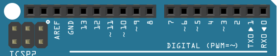
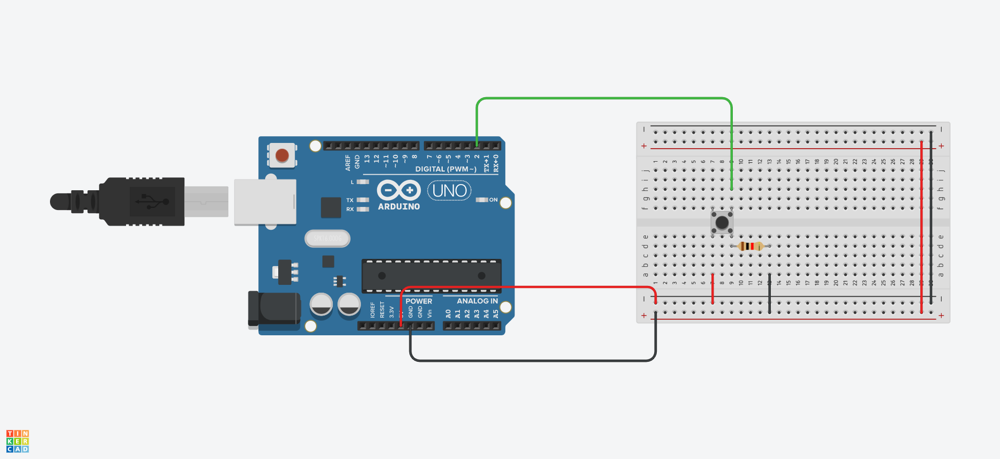
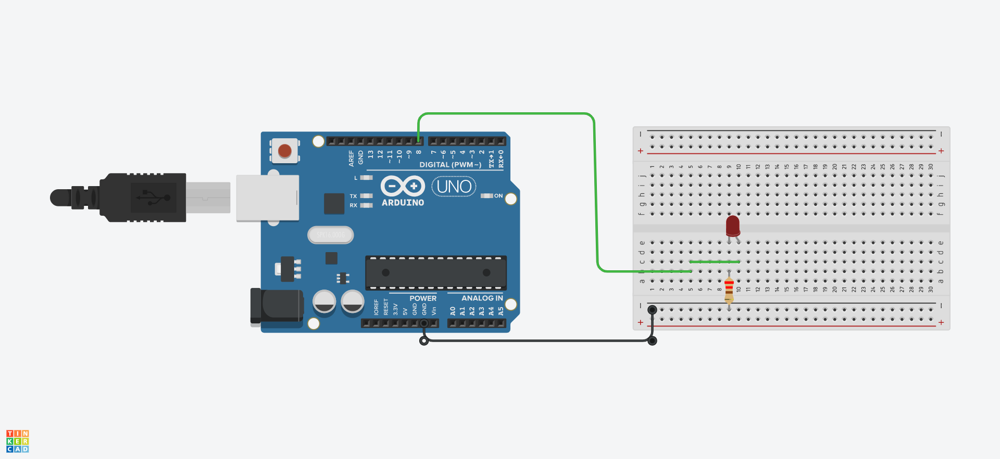
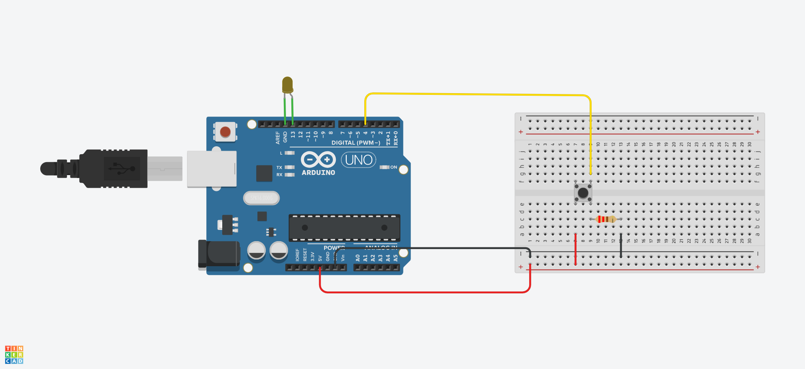
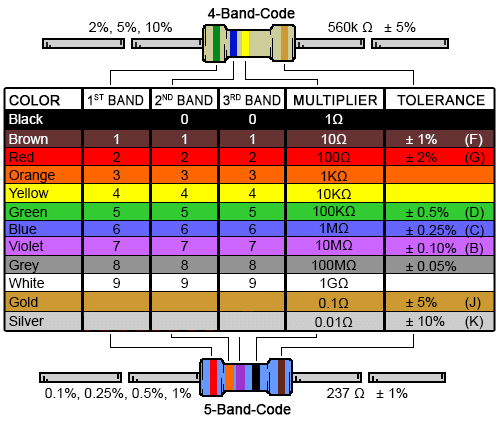
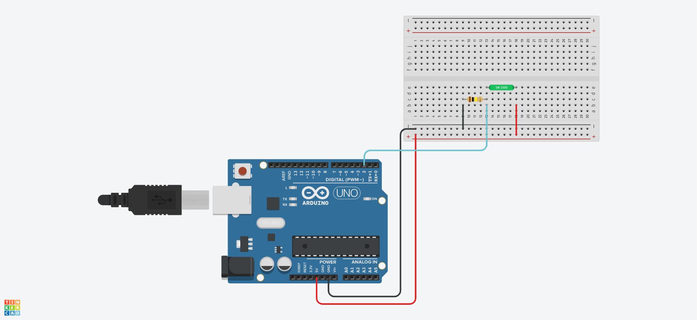
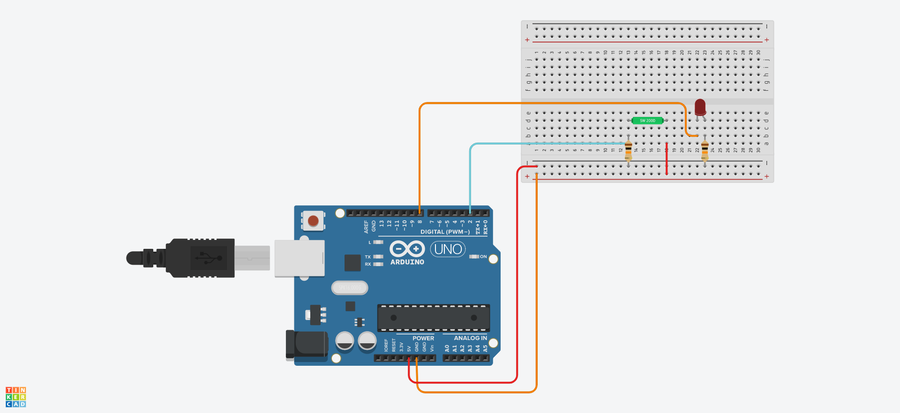
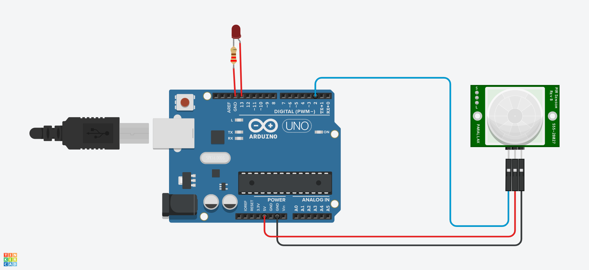
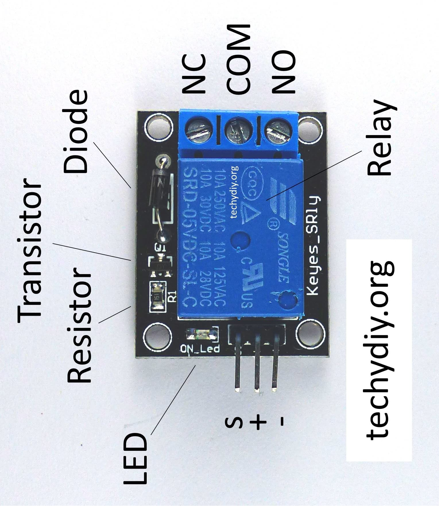

## Digital Pins

* **RXD at 0** used for **Serial receiving**.

* **TXD at 1** used for **Serial writing**.

* pins from **0 to 13 are all digital** and after that we have pin GND.

* pins from **A0 to A5 are all Analog**.



## pinMode()

* This function set the **functionality to the pin**. and this functionality can be **INPUT or OUTPUT**

* **INPUT** use when you connect your **Arduino** to the **sensor**.

* **OUTPUT** use when you connect your **Arduino** to **LED, motor etc**.

## digitalRead

* we have total **14 digital** pins in **arduino uno** from **0 --> to --> 13**

```c++

digitalRead(InputPin)

```

## Example Code for Pushbutton

```c++

/*

* Dependency:
  - Arduino Board
  - A momentary switch, or button.
  - 10k ohm resistor
  - hook-up wires
  - breadboard

* TB: 
  - closed = pressed = 1
  - open = unpressed = 0

*/

int pushButton = 2;

void setup() {
  Serial.begin(9600);  //initialize serial communication at 9600 bps:
  pinMode(pushButton, INPUT); //make the pushbutton's pin an input:
}

void loop() {
  int buttonState = digitalRead(pushButton); // read the input pin:
  Serial.println(buttonState); // print out the state of the button:
  delay(10); // delay in between reads for stability
}

```




# digitalWrite

* in digitalWrite the pin should configured as OUTPUT with pinMode()

* Atmega pins can source (provide positive current) up to **40 mA (milliamps)**

```c++

digitalWrite(OutputPin)

```


## Example Code for LED

```c++

/*

* Dependency:
  - 1 x LED
  - 1 x 220 ohm resistor
  - 1 x Arduino UNO
  - 1 x breadboard
  - 2 x jumper Wires

*/


const int led = 8; // use digital I/O pin 8

void setup() {
  pinMode(led,OUTPUT); // set pin 8 to be an output output
}

void loop() {
  digitalWrite(led,HIGH); // set pin 8 HIGH, turning on LED
  delay(1000); // delay 1000 milliseconds
  
  digitalWrite(led,LOW); //set pin 8 LOW, turning off LED
  delay(1000); // delay 1000 milliseconds
}

```




## Code Example of Toggle Switch and LED

```c++

/*

* Dependency:
  - Arduino Board
  - Push Button
  - LED
  - 220 ohm or 10K ohm Resistors
  - Jumper Wires
  - Breadboard

*/

// Example 1

int pushButton = 4;
int ledPin = 13;
int x=0;

void setup() {
  Serial.begin(9600);
  pinMode(pushButton, INPUT);
  pinMode(ledPin, OUTPUT); 
}

void loop() {
  
	while (x<2) {
  		if (digitalRead(pushButton)== HIGH)
          x=x+1;
          delay(200);
      
            switch (x){
              case 0:
              digitalWrite (ledPin, LOW);
              Serial.println("B");
              break;
              case 1:
              digitalWrite (ledPin, HIGH);
              Serial.println("A");
              break;
            } 
	}

  x=0;
}


// Example 2

const unsigned int buttonPin = 4;
const unsigned int ledPin = 8;

int buttonState = 0;
int oldButtonState = LOW;
int ledState = LOW;

void setup() {
  pinMode(ledPin, OUTPUT);
  pinMode(buttonPin, INPUT_PULLUP);
}

void loop() {
  buttonState = digitalRead(buttonPin);

  if (buttonState != oldButtonState &&
      buttonState == HIGH)
  {
    ledState = (ledState == LOW ? HIGH : LOW);
    digitalWrite(ledPin, ledState);
    delay(50);
  }
  oldButtonState = buttonState;
}


// Example 3

const int buttonPin = 4; //the button connect to pin
const int ledPin = 13; //the led connect to pin13
int buttonState = 0; // variable for reading the pushbutton

void setup() {
  pinMode(buttonPin, INPUT); //initialize thebuttonPin as input
  pinMode(ledPin, OUTPUT); //initialize the led pin as output
}

void loop() {

  buttonState = digitalRead(buttonPin);

  if (buttonState == HIGH) {
    digitalWrite(ledPin, HIGH); //turn the led on
  } else {
    digitalWrite(ledPin, LOW); //turn the led off
  }

}

```



## Resistor



```c++

// 4 Band-Code

--------------------------------------------------
1 Band   2 Band   4 Band   Multiplier   Tolerance
--------------------------------------------------

brown black black   gold
1     0     1ohm    +-5%

10 * 1ohm +-5% = 10ohm +-5%

--------------------------------------------------

purple white black  gold
7      9     1 ohm  +-5%

79 * 1ohm +-5% = 79ohm+-5%

--------------------------------------------------

green red yellow  gold
5     2   10Kohm  +-5%

52*10Kohm +-5% = 520Kohm +-5%

--------------------------------------------------

//5 Band-Code


--------------------------------------------------
1 Band   2 Band   3 Band   4 Band   Multiplier   Tolerance
--------------------------------------------------

Red Red Black Blue     Gold
2   2   0     10Kohm   +-5%

220 * 10Kohm +-5% = 220Mohm +-5%

```

## Tilt Sensor (Code Example)

* **tilt sensor** is a **component that can detect the tilting of an object**.

* It contains a **metallic ball** inside that will **commute the two pins of the device from on to off**

```c++

/*

* Dependency:
  - Arduino Board
  - Push Button
  - LED
  - 10k or 100K ohm Resistors
  - Jumper Wires
  - Breadboard

*/


int tilt = 2;
// the number of the tilt pin

void setup() {
  pinMode(tilt, INPUT);
  // initialize the tilt pin as an input:
  Serial.begin(9600);
}

void loop() {
  int a = digitalRead(tilt);
	Serial.println(a);
}

```



```c++

const int tilt = 2; // the number of the tilt pin
const int ledPin = 8; // the number of the LED pin
int buttonState = 0; // variable for reading the pushbutton status

void setup() {
  pinMode(ledPin, OUTPUT); // initialize the LED pin as an output:
  pinMode(tilt, INPUT);
  // initialize the tilt pin as an input:
}

void loop() {
  buttonState = digitalRead(tilt); // read the state of the pushbutton value:
  if (buttonState == HIGH) {
    digitalWrite(ledPin, HIGH); // turn LED on:
  } else {
    digitalWrite(ledPin, LOW); // turn LED off:
  }
}

```



## Pir Motion

* Pir motion detect **motion based on changes in infrared light** in the environment.

* PIR stand for **Passive Infrared**.

* the PIR motion sensor measures **infrared light** from objects in its field of view.

* The sensor outputs a 5V signal

* range of detection of about **6–7m**.

## Pir Motion Code Example

```c++

int led = 13;
int sensor = 2;
int val = 0;

void setup() {
  pinMode(led, OUTPUT);
  // initalize LED as an output
  pinMode(sensor, INPUT); // initialize sensor as an input
}

// initialize serial
void loop() {
  val = digitalRead(sensor); // read sensor value
  if (val == HIGH) {
    // check if the sensor is HIGH
    digitalWrite(led, HIGH); // turn LED ON
  } else {
    digitalWrite(led, LOW); // turn LED OFF
  }
}

```



## Relay

* KEYES 5V Relay Module It is commonly use if the load circuit is AC.


* NC: Normally closed 120-240V terminal
* NO: Normally open 120-240V terminal
* C: Common terminal
* Ground: Connects to the ground pin on the Arduino
* 5V Vcc: Connects the Arduino’s 5V pin
* Signal: Carries the trigger signal from the Arduino that activates the relay



## Relay (Code_Example)

```c++

// Example 1

void setup() {
  pinMode(10, OUTPUT);
}

void loop() {
  digitalWrite(10, HIGH);
  delay(1000); // Wait for 1000 millisecond(s)
  digitalWrite(10, LOW);
  delay(1000); // Wait for 1000 millisecond(s)
}


// Example 2

int RELAY1= 10;

void setup() {
    Serial.begin(9600);
    pinMode(RELAY1, OUTPUT); 
}
void loop() {
    digitalWrite(RELAY1,0);
    Serial.println("Light OFF");
    delay(2000);
    digitalWrite(RELAY1,1); // Turns ON Relays 1
    Serial.println("Light ON"); // // Wait 2 seconds
    delay(2000); // Turns Relay Off
}

```


